> ##### SERGIO PANIAGUA LÓPEZ

> # Definicion de Conceptios Básicos de GIT
Antes que todo el codigo de el proyecto se encuentra en: https://github.com/sergiopani/M8
+ **Repositorio:** es la ubicación o ruta en la que se almacena toda la información de un proyecto, cada proyectp cuenta con un unico repositorio
+ **Github:** Es un portal web que se ha creado para alojar los repositorios de un proyectos de los desarrolladores
+ **Rama:** Sirven para trabajar en una parte concreta de nuestro proyecto de forma que no afecte a la rama principal, asi podemos hacer pruebas sin miedo a equivocarnos
+ **Commit:** Es necesario introducirle un mensaje, hacer un commit seria equivalente a decir Aplicar los cambios y por tanto se sube nuestra nueva version
+ **Push:** LO hariamos despues de realizar un commit
+ **Merge:** Seria hacer una fusion es decir, fusionar los cambios que hay en una rama como en otra, es decir que mexclamos los commits entre las dos ramas
+ **Pull:** Cada vez que hacemos un commit and push, podemos avisar a los demas colaboradores de nuestro commit para que lo validen y encuentren errores etc...

> # Proyecto GIT
Vamos a abrir nuestro IDE Eclipse para desarrolladores vamos a ir al marketplace y vamos a instalar la extension de git: 

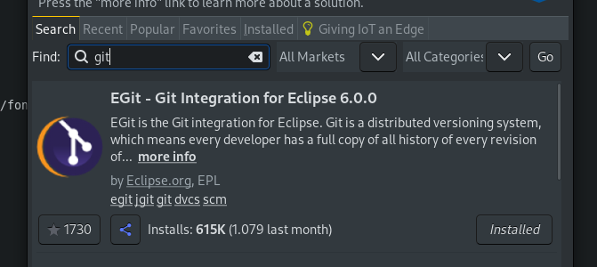

Ahora nos vamos a ir a github y vamos a crearnos una cuenta o logearnos en una existente

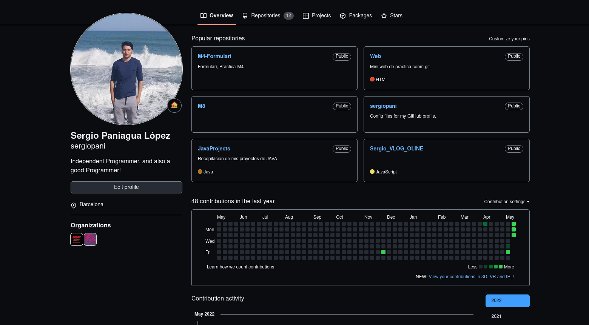
Hay dos formas de conextarse a un repositorio de git:
+ **HTTPS**
+ **SSH**

En nuestro caso lo vamos a hacer mediante SSH, ya que con HTTP no me ha funcionado con eclipse, sin embargo con otros editores como vscode si que me ha funcionado.
Para ello primero vamos a crear una OPEN SSH KEY
Vamos a consola e introducimos el siguiente comando que nos creara una phassprase en un fichero y le pondremos contraseña:(en mi caso 1234)

+ **ssh-keygen -t rsa**

Hacemos un cat del fichero donde nos ha guardado la key 
Tambien la podemos generar mediante eclipse
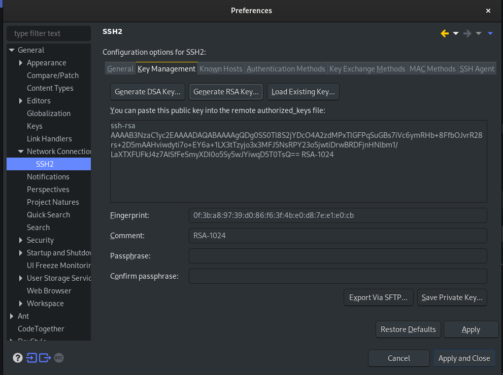

Nos vamos a **github => Usuario => Preferencias => Private SSH KEYS**

En mi caso tengo 2 agregadas ya, una para subir codigo con mi maquina ubuntu(Fedora) y la otra para subir con Windows
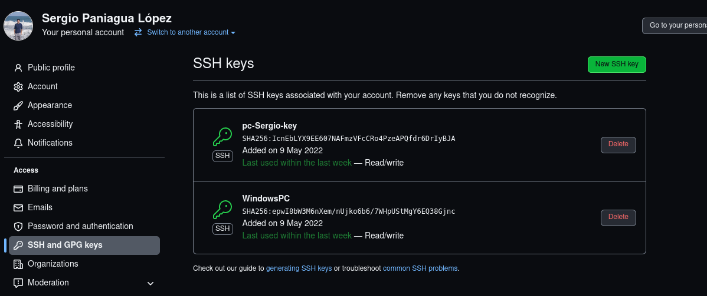

Vamos a añadir git a nuestro proyecto carta boton **derecho => share => team**
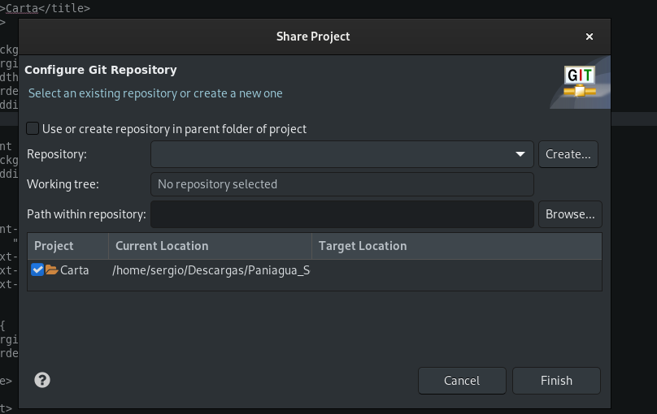
Ahora tendremos git en nuestro proyecto pero sin hacer push a github

Para hacer la conexion podriamos utilizar el comando **git remote add origin "Vinculo SSH"**
En nuestro caso eclipse ya nos lo hace solo si vamos a 
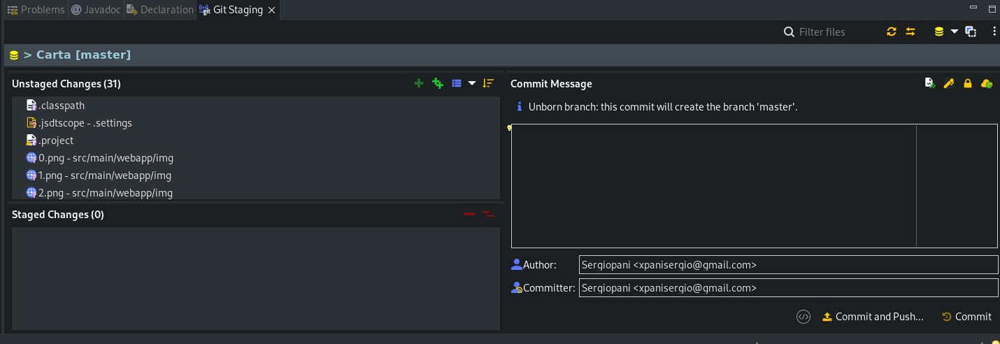

Ahora nos vamos a crear un repositorio en github donde vamos a subir tro proyecto carta junto con el formulario en la misma rama
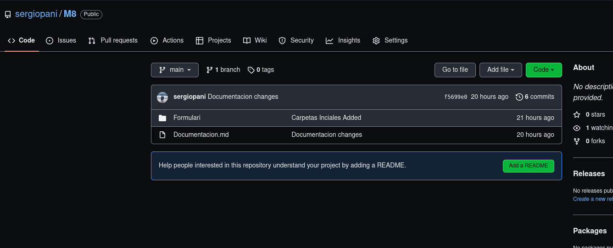
Vamos a pasar todos los archivos al stage area y despues despues hacemos un commit and push
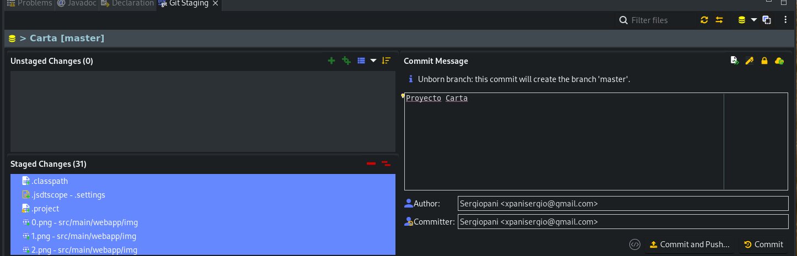

Se nos abrira el recuadro donde, pondremos de rama el origen que en mi caso sera la rama main
y ponermos el **link de ssh** del repositorio que nos ofrece github
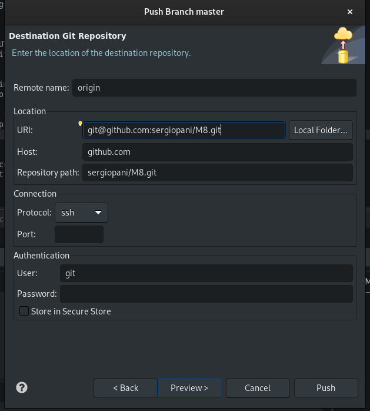
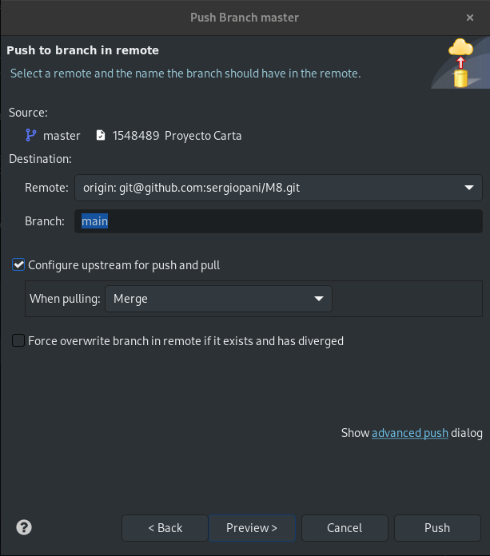

 

Mi proyecto va a tener Solo una rama
+ **Main** => Donde se encuentra un read me y todo el proyecto
+ **Captcha** => Donde se encuentra la version del formulario pero incluyendo el captcha
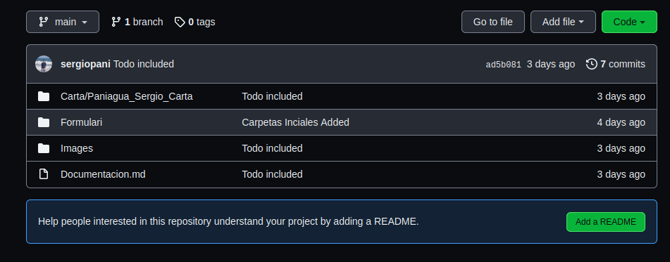

Vamos a crear la braca Captcha, para ello podemos ir a la consola y escribir el comando **git branch captcha** 

Para cambiar de rama y pasar de la main a la captcha podemos usar 
**git checkout captcha**

Ahora ya podemos eliminar archivos en esta rama porque no se van a modificar en la rama **main** por lo tanto no es necesario que tengamos miedo eliminar o modificar.

Para poner un ejemplo ahora mismo en la rama main tenemos:

Y en la rama captcha solo tendriamos el formulario
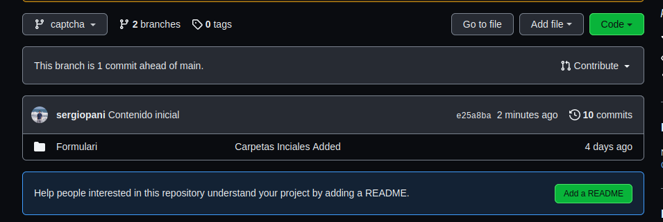

**En el caso de que hicieramos un merge se juntarian los commits de las dos ramas**

