> ##### SERGIO PANIAGUA LÓPEZ

> # Definicion de Conceptios Básicos de GIT
Antes que todo el codigo de el proyecto se encuentra en: https://github.com/sergiopani/M8
+ **Repositorio:** es la ubicación o ruta en la que se almacena toda la información de un proyecto, cada proyectp cuenta con un unico repositorio
+ **Github:** Es un portal web que se ha creado para alojar los repositorios de un proyectos de los desarrolladores
+ **Rama:** Sirven para trabajar en una parte concreta de nuestro proyecto de forma que no afecte a la rama principal, asi podemos hacer pruebas sin miedo a equivocarnos
+ **Commit:** Es necesario introducirle un mensaje, hacer un commit seria equivalente a decir Aplicar los cambios y por tanto se sube nuestra nueva version
+ **Push:** LO hariamos despues de realizar un commit
+ **Merge:** Seria hacer una fusion es decir, fusionar los cambios que hay en una rama como en otra, es decir que mexclamos los commits entre las dos ramas
+ **Pull:** Cada vez que hacemos un commit and push, podemos avisar a los demas colaboradores de nuestro commit para que lo validen y encuentren errores etc...

> # Proyecto GIT
Vamos a abrir nuestro IDE Eclipse para desarrolladores vamos a ir al marketplace y vamos a instalar la extension de git: 

Ahora nos vamos a ir a github y vamos a crearnos una cuenta o logearnos en una existente

Hay dos formas de conextarse a un repositorio de git:
+ **HTTPS**
+ **SSH**

En nuestro caso lo vamos a hacer mediante SSH, ya que con HTTP no me ha funcionado con eclipse, sin embargo con otros editores como vscode si que me ha funcionado.
Para ello primero vamos a crear una OPEN SSH KEY
Vamos a consola e introducimos el siguiente comando que nos creara una phassprase en un fichero y le pondremos contraseña:(en mi caso 1234)

+ **ssh-keygen -t rsa**

Hacemos un cat del fichero donde nos ha guardado la key 
Tambien la podemos generar mediante eclipse

Nos vamos a **github => Usuario => Preferencias => Private SSH KEYS**

En mi caso tengo 2 agregadas ya, una para subir codigo con mi maquina ubuntu(Fedora) y la otra para subir con Windows

Vamos a añadir git a nuestro proyecto carta boton **derecho => share => team**

Ahora tendremos git en nuestro proyecto pero sin hacer push a github

Para hacer la conexion podriamos utilizar el comando **git remote add origin "Vinculo SSH"**
En nuestro caso eclipse ya nos lo hace solo si vamos a 

Ahora nos vamos a crear un repositorio en github donde vamos a subir tro proyecto carta junto con el formulario en la misma rama

Vamos a pasar todos los archivos al stage area y despues despues hacemos un commit and push

Se nos abrira el recuadro donde, pondremos de rama el origen que en mi caso sera la rama main
y ponermos el **link de ssh** del repositorio que nos ofrece github

 

Mi proyecto va a tener Solo una rama
+ **Main** => Donde se encuentra un read me y todo el proyecto
+ **Captcha** => Donde se encuentra la version del formulario pero incluyendo el captcha

Vamos a crear la braca Captcha, para ello podemos ir a la consola y escribir el comando **git branch captcha** 

Para cambiar de rama y pasar de la main a la captcha podemos usar 
**git checkout captcha**

Ahora ya podemos eliminar archivos en esta rama porque no se van a modificar en la rama **main** por lo tanto no es necesario que tengamos miedo eliminar o modificar.

Para poner un ejemplo ahora mismo en la rama main tenemos:

Y en la rama captcha solo tendriamos el formulario

**En el caso de que hicieramos un merge se juntarian los commits de las dos ramas**

> ## BASE DE DATOS

Antes de mostrar como se crea el formulario voy a crear la base de datos con mysql workbench

Tendremos la tabla usuario y carta

En la tabla carta accede el fichero JSP mientras que en la tabla usuario accede el fichero php del formulario

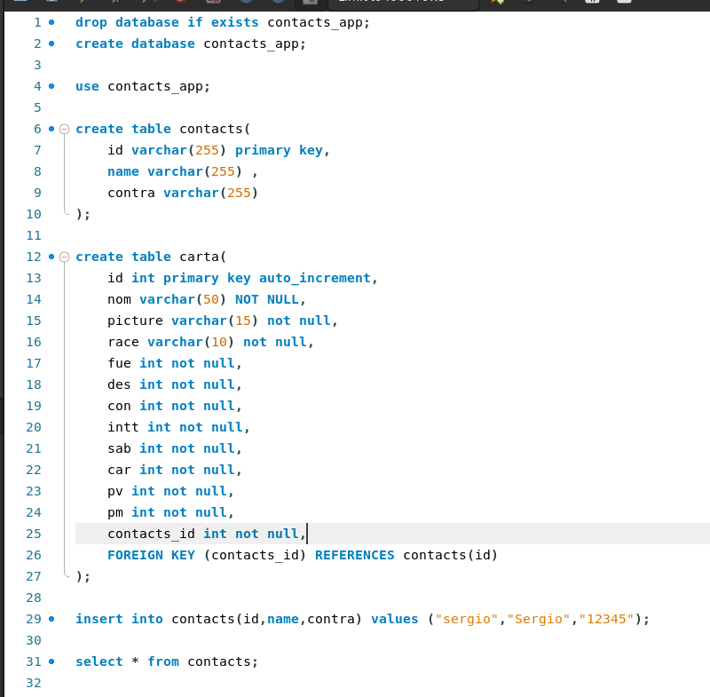

La tabla **contacts** contiene los atributos:
+ **id**: Es un int que se genera automaticamente para identificar a los usuarios
+ **name**: Varchar(255) para el nombre del usuario
+ **contra**: La contraseña del usuario

La tabla **carta** contiene los atributos:
+ **id**: Identifica a cada carta automaticamente
+ **nom**: varchar(50) con el nombre de la carta
+ **picture**: enlace donde se encuentra la foto del personaje de la carta
+ **race**: la raza de la carta
+ **fue, des,con,intt,sab,car,pv**: los valores de la carta
+ **contactsId**: para relacionar las dos tablas y poder saber que cartas tiene un usuario

Para poder conectarnos a la base de datos por php, vamos a tener que crear un fichero de configuracion donde pondremos nuestros datos de la base de datos, el fichero que he creado es **database.php** y incluye esto:
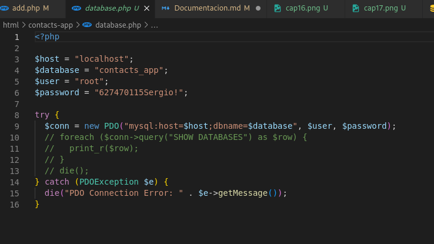

> ## FORMULARIO
Para la creacion rapida de un diseño de una pagina de un formulario he usado el framework bootstrap par importar un diseño ya hecho en html:

Y lo he realizado de esta manera:

La pagina HOME de nuestro formulario se va a mostrar tal que asi
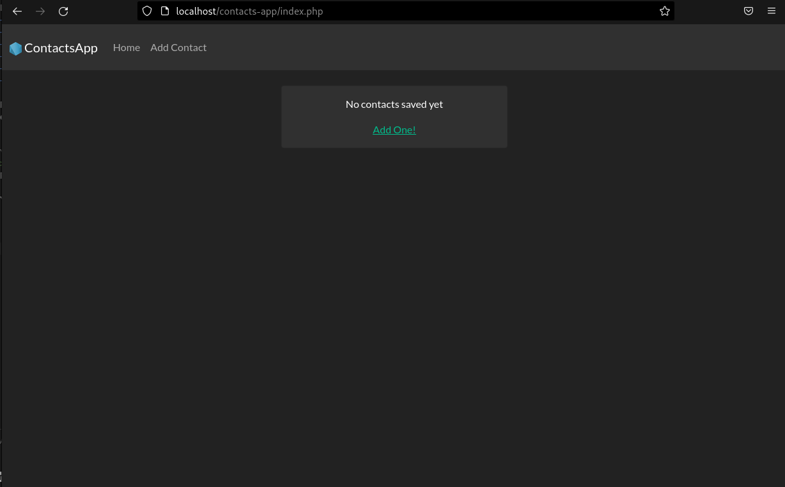

Despues tenemos la pagina de add.php donde vamos a realizar la inseccion de los datos del formulario recojiendo los datos que se introducen con post
y tambien realizando la consulta sql a la base de datos:

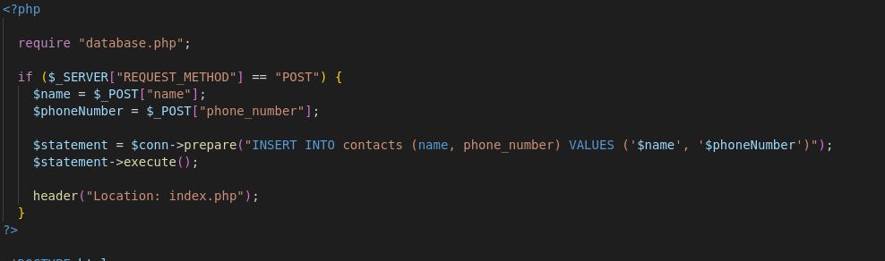

La pagina del formulario nos quedaria tal que asi:

De momento vamos a probar si nos guarda en la base de datos el post que introducimos con el usuario

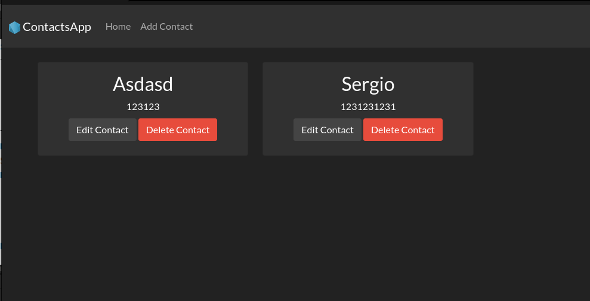

Como podemos ver si que nos ha añadido el contactoy seha guardado en la base de datos, lo podemos comprobar en el workbench realizando un select:
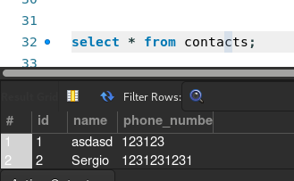

Ahora nos faltaria implementar el formulario para que mostrase todas las cartas de un usuario
Para ello vamos a insertar cartas en la tabla de carta, con datos random, por ejemplo:

> ## Añadir el captcha y subirlo a nuestra nueva rama
Antes de todo voy a realizar un commit de toda la rama main despues la voy a clonar el formulario en la rama captcha y ahi voy a realizar las modificaciones pertinentes:

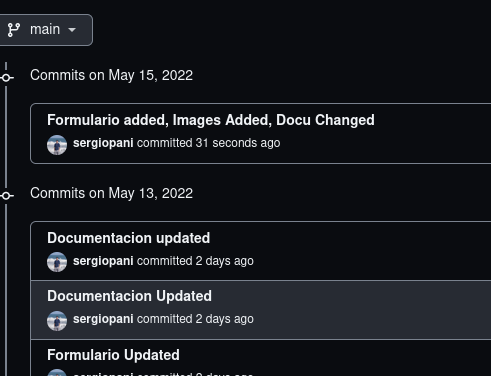

Como ya hemos creado nuestra rama captcha ahora podemos trabajar en ella sin miedo a perder lo que tenemos en main

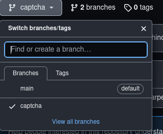

El codigo del captcha lo he sacado del enlace:
https://developers.google.com/recaptcha/docs/display

Asi es como quedaria puesto en la clase add.php junto al formulario:

Esta es la parte que pondriamos en el head
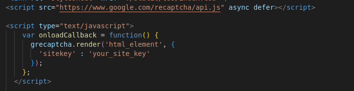
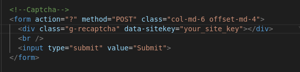

Esto es lo que pondriamos en el form:
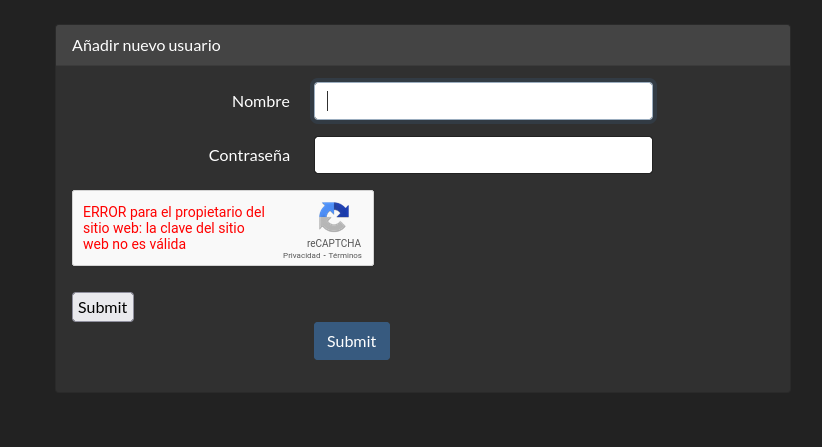

Nos sale un error en el captcha, ese error nos indica que estamos usando una clave recaptcha incorrecta.

Por lo tanto deberiamos agregar una key a nuestra web, para ello necesitaremos google chrome y registrar nuestro dominio pero como estamos en localhost no vamos a hacerlo.

> ## LISTA DE COMMITS EN GIT
